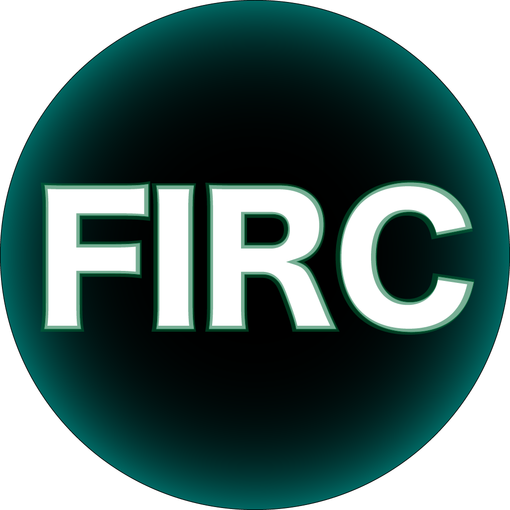
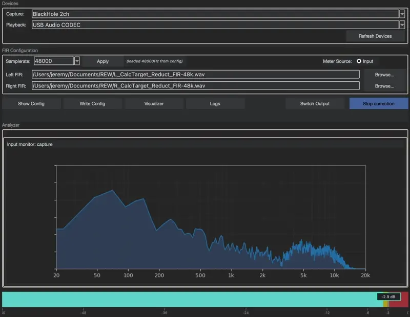

<div align="center" style="margin-bottom: 8px;">
  
</div>

##

**FIRC** – a Python application that helps you use **CamillaDSP** for room correction.  Allows you to apply a **FIR (Filter Frequency Impulse Response)** file created from acoustic measurements in software like REW (Room EQ Wizard) between your coreaudio and output, to improve monitoring.


<div align="center" style="margin-bottom: 24px;">
  
</div>


## Requirements

### macOS
- **CamillaDSP v3** (automatically downloaded by the build script)
- **SwitchAudioSource**  
    Install via Homebrew: 
    ```bash
    brew install switchaudio-osx
    ```

- **Python**
    ```bash
    python3.11 -m venv .venv
    source .venv/bin/activate
    pip install -r requirements.txt
    ```
             

## Quick run (no build)

Run FIRC directly from source:
Create and activate a venv (macOS zsh)
```bash

python3.11 -m venv .venv
source .venv/bin/activate
```
```bash
pip install -r requirements.txt
python3 "FIRC.py"
```


## Build

Create and activate a venv (macOS zsh)
```bash

python3.11 -m venv .venv
source .venv/bin/activate
```
Install build deps
```bash
pip install -r requirements.txt
```

Run the build script (creates dist/FIRC.app)
```bash
chmod +x build_mac_app.sh
./build_mac_app.sh
```


